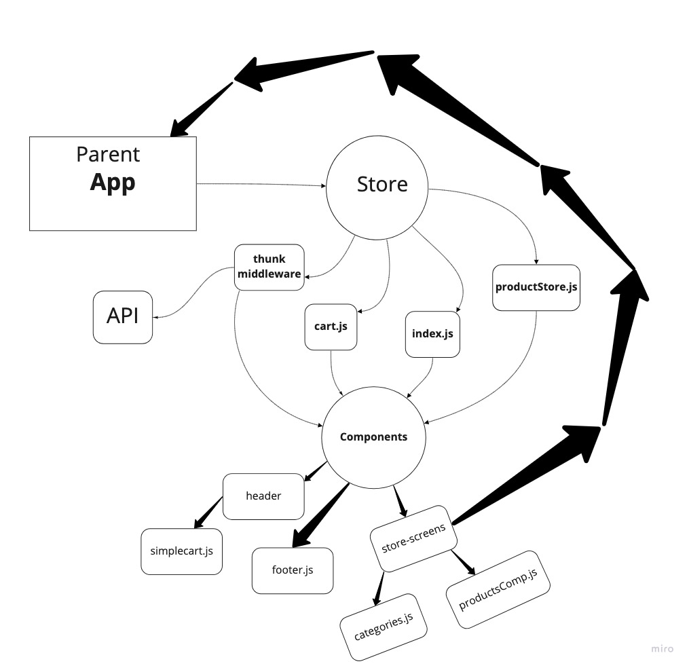

# Store Front Application

Set the basic scafolding of the app to set up the file structure and state management.

Authors: Tahmina Ringer

## User Stories
- As a user, I expect to see a list of available product categories in the store so that I can easily browse products.
- As a user, I want to choose a category and see a list of all available products matching that category
- As a user, I want a clean, easy to use user interface so that I can shop the online store with confidence

## Run the App
npm start
Runs the app in the development mode.

## UML
